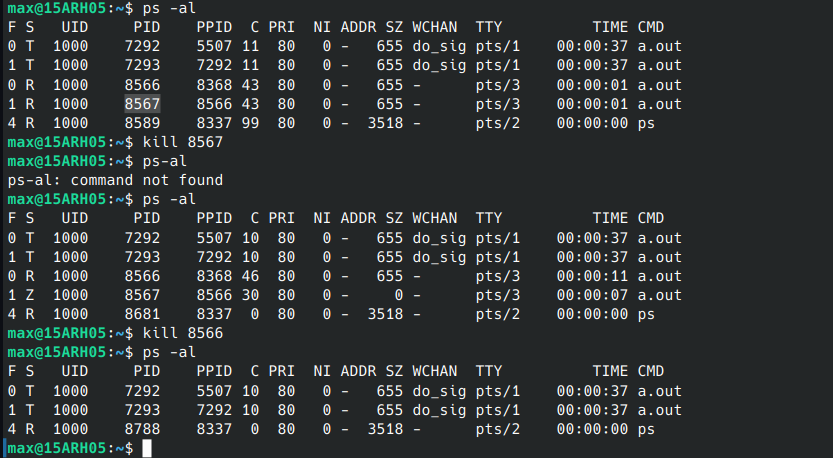
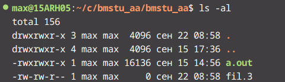
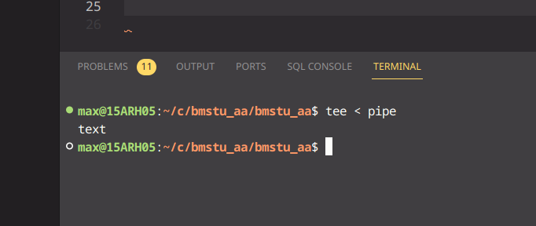

для получения процесса зомби выполните следующие действия:

a) удалите командой  kill потомка и посмотрите с помощью команды ps его новый статус – Z;

ps -al

b) удалите предка.

ghj


 Для получения «осиротевшего» процесса запустите программу еще раз, но в этот раз
удалите предка и посмотрите с помощью команды ps идентификатор предка у
продолжающего выполняться потомка; идентификатор предка будет изменен на 1, так
как процесс был «усыновлен» процессом

Жёсткой ссылкой (англ. hard link) в UFS-совместимых файловых системах называется
структурная составляющая файла — описывающий его элемент каталога.
В Unix к одним и тем же файлам можно обращаться под разными именами.
Другими словами, имена файлов также называются ссылками на этот файл, причем это -
жесткие ссылки.

Мягкая ссылка, или символическая ссылка, если коротко, символическая ссылка - совсем
другое объект. Это файл, который содержит полное имя другого файла и позволяет
осуществлять автоматический поиск системного имени.
создание ссылок




```
    ln -s /path/to/original/file /path/to/symlink

    /path/to/original/file — это путь к оригинальному файлу или каталогу, на который вы хотите сослаться.
    /path/to/symlink — это путь, где вы хотите создать символическую ссылку.
```

# пграммный канал

## именованный

Программный канал - это специальный файл, в который можно «писать» информацию и из
которого эту информацию можно «читать». Причем порядок записи информации и
последующего чтения – FIFO (очередь).




Конвейеры создаются с помощью неименованных программных каналов.
Конвейееры и примеры их использования
С помощью конвейеров удается комбинировать результаты выполнения разных команд,
получая в результате новое качество.

## неименованный

Неименованные программные каналы в командной строке создаются с помощью символа '| '.
Неименованные программные каналы могут использоваться для передачи сообщений только
между процессами-родственниками, т.е. между процессами, которые имеют общего
предка.


аппаратное прерывание системного таймера int 8h
программное прерывание ich
