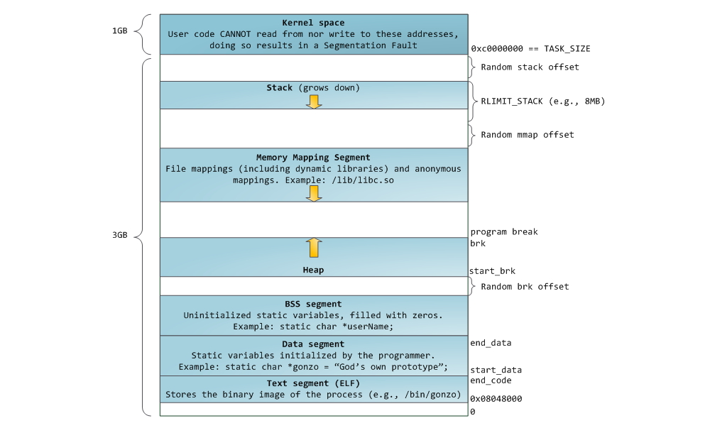

**Процесс** в Linux (как и в UNIX) это - программа, которая выполняется в отдельном защищенном виртуальном адресном пространстве.

Часть времени процесс выполняется в режиме задачи ( пользовательском режиме ) и тогда он выполняет собственный код, часть времени процесс выполняется в режиме ядра и тогда он выполняет реентерабельный код операционной системы.

В Linux поддерживается классическая схема мультипрограммирования. Linux поддерживает параллельное (или квазипараллельное при наличии только одного процессора) выполнение процессов пользователя. Каждый процесс выполняется в собственном защищенном виртуальном адресном пространстве. Это значит, что ни один процесс не обратиться в адресное пространство другого процесса.   Процессы защищены друг от друга и крах одного процесса никак не повлияет на другие выполняющиеся процессы и на всю систему в целом.

Ядро предоставляет системные вызовы для создания новых процессов и для управления запущенными процессами. Любая программа может начать выполняться только если другой **процесс ее запустит.**

Для создания процессов используется системный вызов **fork().** 

Системный вызов fork() создает новый процесс (рис.1), который является копией процесса-предка: процесс-потомок наследует адресное пространство  процесса-предка, дескрипторы всех открытых файлов и сигнальную маску и т.д.

Процесс потомок имеет идентичные с родителем области данных и стека. Процесс-потомок начинает работу в режиме задачи после возвращения из системного вызова fork(). 

Так как fork()  возвращает дочернему процессу число 0, а родительскому —  PID (Process IDentifier — идентификатор процесса) дочернего процесса. ==> можем различить эти процессы хоть у нас одинаковые регистры данные переменные ид

```python
#include <sys/types.h>
#include <unistd.h>
int main(void)
{
pid_t childpid ; /* если fork завершился успешно, pid > 0 в родительском процессе */
if ((childpid = fork( )==-1) 
{
     perror(“Can't fork”); /* fork потерпел неудачу (например, память или какая-либо */
     exit(1)                         /*таблица заполнена) */
} 
else if (childpid == 0)
 {
     /* здесь располагается код процесса-потомка */
 } else
    {
       /* здесь располагается родительский код */
    }
return 0;
}
```

### **_Рассмотрим более подробно, что же делается при выполнении вызова fork():_**
   
1. Резервируется пространство свопинга для данных и стека процесса-потомка;
2. Назначается идентификатор процесса PID и структура proc потомка;
3. Инициализируется структура proc потомка. Некоторые поля этой структуры копируются от процесса-родителя: идентификаторы пользователя и группы, маски сигналов и группа процессов. Часть полей инициализируется 0. Часть полей инициализируется специфическими для потомка значениями: PID потомка и его родителя, указатель на структуру proc родителя;
4. Создаются карты трансляции адресов для процесса-потомка;
5.  Выделяется область u потомка и в нее копируется область u процесса-предка;
6. Изменяются ссылки области u на новые карты адресации и пространство свопинга;
7. Потомок добавляется в набор процессов, которые разделяют область кода программы, выполняемой процессом-родителем;
8. Постранично дублируются области данных и стека родителя и модифицируются карты адресации потомка;
9. Потомок получает ссылки на разделяемые ресурсы, которые он наследует: открытые файлы (потомок наследует дескрипторы) и текущий рабочий каталог;
10. Инициализируется аппаратный контекст потомка путем копирования регистров родителя;
11. Поместить процесс-потомок в очередь готовых процессов;
12. Возвращается PID в точку возврата из системного вызова в родительском процессе и 0 - в процессе-потомке.

**Еще раз об оптимизации fork()**

Системный вызов **fork**() должен предоставить процессу-потомку логически идентичную копию адресного пространства его родителя. В большинстве случаев потомок заменяет предоставленное адресное пространство, так как сразу же после выполнения fork вызывает exec или exit. Таким образом, создание копии адресного пространства (так, как это реализовано в первых системах UNIX) является не оптимальной процедурой.

Вышеописанная проблема была решена двумя различными способами. 
Сначала был разработан метод копирования при записи (copy-on-write), 
впервые реализованный в ОС **System** V и в настоящий момент используемый в 
большинстве систем UNIX и LINUX.
 При таком подходе:
- страницы данных и стека родителя временно получают атрибут «только для чтения» и маркируются как «копируемые при записи»;
-  потомок получает собственные карты трансляции адресов ( таблицы страниц ), которые ссылаются на страницы процесса-предка, т.е. процесс-потомок  использует одни и те же страницы памяти вместе со своим родительским процессом; 
- если кто-то из них (родитель или потомок) попытается изменить страницу памяти, произойдет ошибочная исключительная ситуация по правам доступа, так как страницы доступны только для чтения. Затем ядро системы запустит обработчик исключительной ситуации, который обнаружит, что страница помечена как «копируемая при записи», и создаст новую ее новую копию, которую уже можно изменять. 

- Таким образом, происходит копирование только тех страниц памяти, которые требуется изменять, а не всего адресного пространства целиком. 
Если потомок вызовет exec() или exit(), то защита страниц памяти вновь станет обычной, и флаг «копирования при записи» будет сброшен. 
В

**системе BSD UNIX** представлен несколько иной подход к решению проблемы, реализованный в новом системном вызове **vfork(). Функция vfork()** не производит копирования. Вместо этого процесс-родитель предоставляет свое адресное пространство потомку (потомок получает карты трансляции адресов предка ) и блокируется до тех пор, пока тот не вернет его. Затем происходит выполнение потомка в адресном пространстве родительского процесса до того времени, пока не будет произведен вызов exec или exit(), после чего ядро вернет родителю его адресное пространство и выведет его из состояния сна. Системный вызов vfork() выполняется очень быстро, так как не копирует даже карты адресации. Адресное пространство передается потомку простым копированием регистров карты адресации. Однако следует отметить, что вызов vfork является достаточно опасным, так как позволяет одному процессу использовать и даже изменять адресное пространство другого процесса. Это свойство vfork используют различные программы, такие как csh. 
Программист может воспользоваться **vfork() вместо fork(),** если планирует вслед за ним сразу вызвать exec().




 ## Процесс-сирота
Системный вызов fork() создает новый процесс – процесс-потомок.
Отношение родитель – потомок создает иерархию процессов (см. указатели на потомков в struct proc). Если родительский процесс завершается раньше своих потомков, то в системе выполняется так называемое усыновление: процесс-потомок усыновляется процессом с идентификатором 1 (процессом «открывшим» терминал и создавшим терминальную группу) или в Ubuntu процессом-посредником systemd –user, который в итоге является потомком процесса с идентификатором 1.

# Задание:
Написать программу, запускающую не мене двух новых процессов системным вызовом fork(). В предке вывести собственный идентификатор (функция getpid()), идентификатор группы ( функция getpgrp())  и идентификаторы потомков. В процессе-потомке вывести собственный идентификатор, идентификатор предка (функция getppid()) и идентификатор группы. Убедиться, что при завершении процесса-предка потомок, который продолжает выполняться, получает идентификатор предка (PPID), равный 1 или идентификатор процесса-посредника.
